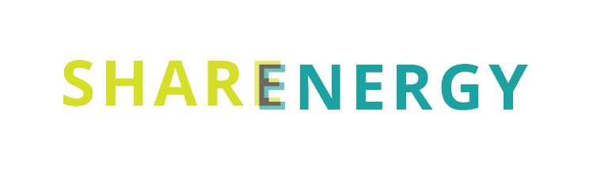
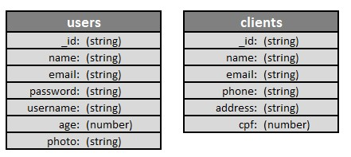

<h1 align=center> Projeto Sharenergy - Vaga DEV Back-End Jr.   Thiago Daniel Alvim Rodrigues</hi>  

  

---

## Sobre a SHARENERGY

No ramo da produção de energia fotovoltaica, há a modalidade de produção compartilhada. Nessa modalidade, diferentes pessoas investem na construção de uma mesma usina fotovoltaica e dividem o retorno finaceiro referente à energia gerada pela usina.

Acreditamos que as energias renováveis terão um lugar dominante em nossa economia pelo resto de nossas vidas. Trabalhamos no sentido de ampliar o impacto positivo que as energias renováveis podem ter no meio ambiente e nas nossas vidas. O sucesso da SHARENERGY é resultado de nossa equipe apaixonada, juntamente com nosso compromisso de oferecer a melhor solução.

Sabemos que negócios enfrentam desafios únicos e por isso oferecemos soluções turnkey, customizadas, economicamente viáveis e seguras.

A Startup figura entre as top 10 EnergyTechs do ranking 100 Open Startups desde 2018. Prova de que a inovação está enraizada em nossa cultura. Somos uma startup em estágio de crescimento e você trabalhará diretamente com os fundadores, ajudando a definir a visão, o produto e a experiência do usuário.

  
  

## 💻 Sobre o projeto

 

Construir uma aplicação web (frontend e backend) capaz de realizar a comunicação com APIs distintas, além de um CRUD.

## Aplicação

- A página inicial da aplicação deve ser uma `Login Page`;
- O usuário deve ser capaz de se autenticar utilizando o username `desafiosharenergy` e password `sh@r3n3rgy`, também, deve existir a possibilidade do usuário utilizar o `remember me` para realizar logins automáticos, sem a necessidade de digitar username e password após o primeiro acesso;
- Após o Login, a página principal deve conter uma listagem de usuários gerada a partir da api [Random User Generator](https://randomuser.me/), a lista deve conter a foto do usuário, nome completo, email, username e idade. Além disso, os requests devem ser páginados, porém, é de critério do participante do desafio a quantidade de resultados a serem exibidos por página e variações para o mesmo. Também, deve haver uma search para buscar usuários por nome, email ou username;
- Em uma segunda página, o usuário deve ser capaz de selecionar um status code http qualquer, e, após a seleção, deve ser retornada uma imagem da api [HTTP Cat](https://http.cat/) relacionada ao status escolhido, caso não exista tal imagem, deve ser retornada uma imagem de not found à critério de escolha do participante do desafio;
- Em uma terceira página, deve haver um botão de refresh que, ao ser clicado, deve retornar uma imagem aleatória da api [Random Dog](https://random.dog/);
- Em uma quarta página, deve haver uma lista de clientes, através da qual o usuário deve ser capaz de cadastrar novos clientes, visualizar informações de um cliente específico, atualizar um cliente e deletar clientes. O cadastro deve possuir nome, email, telefone, endereço e cpf.

### Requisitos da aplicação e de código

- Interface amigável, bonita e limpa
- Responsividade
- Clean Code

### Ferramentas e Stack a ser utilizado

- ReactJS para o frontend
- NodeJS (com ou sem frameworks) ou Golang para o backend
- MongoDB
- TypeScript
- HTML e CSS

### Aprimoramentos adicionais da aplicação (opcional)

A aplicação criada para o desafio pode ser aprimorada com recursos pensados por você. A seguir, foram listadas algumas sugestões do que poderia ser feito:

- Testes
- Documentação

### Mas, afinal, quais ferramentas a Sharenergy utiliza?

* [Javascript](https://developer.mozilla.org/pt-BR/docs/Web/JavaScript) e [Typescript](https://www.typescriptlang.org/)
* Front-end: [ReactJS](https://reactjs.org/) e [React Native](https://reactnative.dev/)
* Back-end: [Node.js](https://nodejs.org/en/), [NestJS](https://nestjs.com/) e [Go](https://golang.org/)
* Banco de dados: [MongoDB](https://www.mongodb.com/) do lado do servidor e [Minimongo](https://guide.meteor.com/collections.html) do lado do cliente (cache)
* Gerenciamento de Containers: [Docker](https://www.docker.com/)
* Gerenciamento de Repositórios: [NX](https://nx.dev/)
* UI: [Tailwind CSS](https://tailwindcss.com/) e [Material-UI V4](https://v4.mui.com/)
* Sistema Operacional (principal): [Linux](https://www.linux.org/), também sendo possível utilizar o [Windows Subsystem for Linux](https://docs.microsoft.com/en-us/windows/wsl/) (WSL)

## O que devo entregar?

Esperamos de você duas entregas: o código no GitHub e um vídeo explicativo no YouTube.

### Instruções

- Faça um fork desse repositório.
- Em seguida, crie uma branch, cujo nome é o seu nome completo, no seguinte formato: meu-nome-completo.
- Resolva o desafio realizando versionamento local e remoto. Fique à vontade em criar outras branches durante o desenvolvimento do código.
- Inclua no README.md uma breve instrução de instalação e de execução da aplicação criada.
- Faça um vídeo que explique o que você fez no desafio, com duração aproximada de 5 minutos. A facecam é opcional, mas bem-vinda. O vídeo deve ser postado no YouTube (pode deixar como não listado) e seu link deve ser colocado no README.md.
- Ao finalizar o desafio, faça um pull request de sua branch para esse repositório.

### Prazo limite de entrega

O pull request com sua solução do desafio deve ser feito até o prazo limite de entrega, às 23:59 horas do dia 10/01/2023, recebido por email com a descrição do desafio.

## :wrench: Como usar a API:

1. Após clonar o repositório, executar o comando `npm install` ou `yarn install`.
2. Acessar o arquivo `.env example`, renomear o arquivo para `.env` e alterar a conexão do banco de dados com as seguintes instruções:
- MONGO_HOST="local irá rodar o servidor; exemplo 'localhost' "
- MONGO_PORT="porta utilizada pelo mongo; por padrão o mongo utiliza a porta 27017"
- MONGO_USER="nome de usuario no mongo"
- MONGO_PASS="senha de usuario no mongo"
- MONGO_NAME="Nome do banco de dados: Sharenergy"
- SECRET_KEY="criar senha interna para jsonwebtoken"

Obs: Caso possua Usuário e Senha no MongoDB, acesse o arquivo './src/infrastructure/persistence/mongo/mongo.database.ts' e descomentar linhas '10', '11', '18', '19' e '22' e comente a linha '21'. Caso não possua Usuário e Senha no MongoDB, deixar campos 'MONGO_USER' e 'MONGO_PASS' em branco.

3. Executar o comando `npm run mocks` que irá gerar o banco de dados e popular com exemplos.
4. Executar o comando `npm run debug` para iniciar sua conexão com o servidor
6. Caso tudo tenha dado certo, você está pronto para testar a API, caso não, revise o passo-a-passo

## :floppy_disk: Banco de dados:

O Banco de Dados foi criado no MongoDB Compass seguindo padrão de tabelas e colunas exposto a seguir:

 

---

## :memo: Documentação da API

A Documentação da API, rotas e exemplos foram feitos através do Postman e publicado no link:  

<h1>

 <a href="https://documenter.getpostman.com/view/24484577/2s8Z72VrRr"> Documentação API - Postman </a> 

</h1>
 

<h2> 👨‍💻 Contribuidor </h2> 

<h3>
<table align=center>
  <tr>

   <td align="center">   Thiago Rodrigues   
   </td>
   
  </tr>
</table> </h3>

## 🛠 Tecnologias

As seguintes ferramentas foram usadas na construção do projeto:
  

  
  
  
  
  
  
  
  
  
  
  
  

